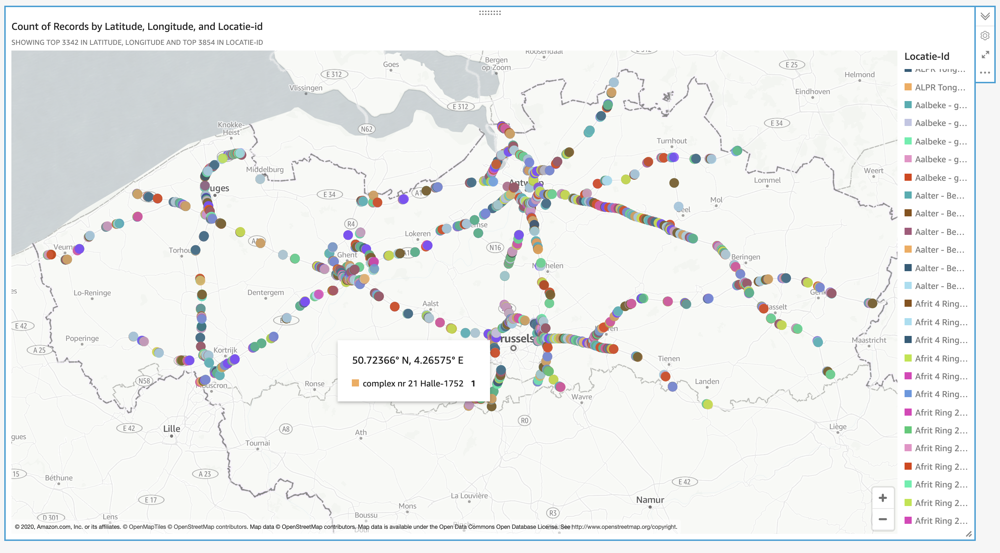
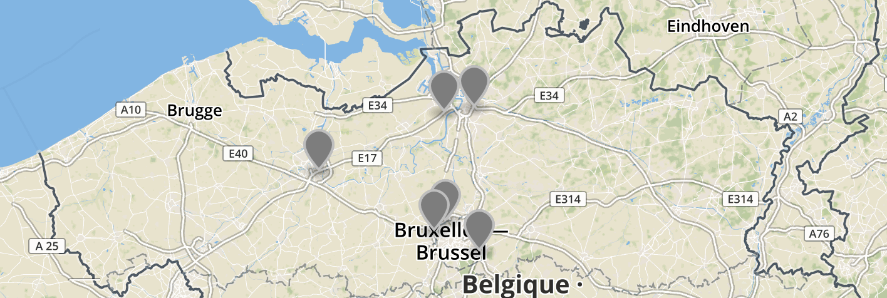
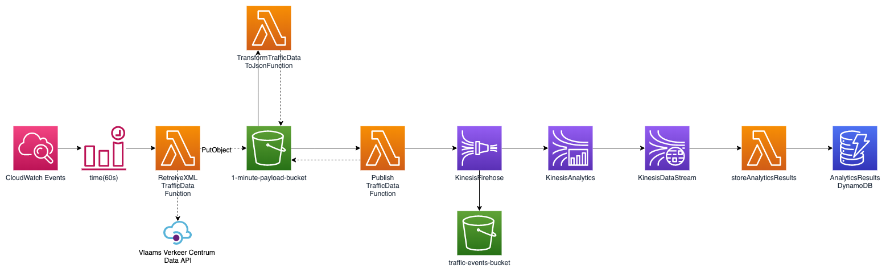

# Serverless data pipelines - Flanders Traffic analysis

In this project we want to analyze traffic data in flanders in realtime.  
From this data we can detect traffic jams or the traffic jams that are emerging / dissolving.

As you can see from the map below the government provides measurements from 4600 locations in flanders every minute.



From these I selected the following six locations to filter on:

**Measurement locations** 

| Description        |  LocationId           | name - id  |
| ------------- |:-------------:| -----:|
| Buitenring Brussel in Wemmel     | 1897 | Complex Wemmel Deel 2 Zuid - 1897 |
| E17 Gent-Antwerpen tussen Kruibeke en Zwijndrecht      | 957      |   complex Kruibeke (16) - 957 |
| Binnenring Brussel tussen Groot-Bijgaarden en Zellik | 3159     |    Knooppunt Groot-Bijgaarden West - 3159 |
| Binnenring Antwerpen tussen Antwerpen-Oost en Borgerhout | 3977     |    R1 RSS Snede kmpt 7,0 - 3977 |
| Binnenring Brussel tussen Wezembeek-Oppem en Tervuren | 1065     |    R0 kmpt 23,7 dubbele seinbrug - 1065 |
| E17 Antwerpen-Gent ter hoogte van Gentbrugge | 575      |    viaduct Gentbrugge - 575 |




*created with [http://geojson.io/](http://geojson.io/)

We could allow a lot more locations in a later phase of the project.  
Often there are different measurements for every traffic lane.
If this is the case I used the data from the lane on the right side of the road.

## Architecture


Every minute a large blob of xml data is ingested from the API of the flemish traffic center.
This is a large file of about 8 MB.
The architecture allows the data to be streamed in near real time in small events.
These events are transformed and extracted from the big xml file and look like this:
```json
{
  "beschrijvende_id": "H221L20",
  "unieke_id": "622",
  "lve_nr": "50",
  "tijd_waarneming": "2020-04-07T11:30:00+01:00",
  "tijd_laatst_gewijzigd": "2020-04-07T11:31:21+01:00",
  "actueel_publicatie": "1",
  "beschikbaar": "1",
  "defect": "0",
  "geldig": "0",
  "verkeersintensiteit_klasse1": "0",
  "voertuigsnelheid_rekenkundig_klasse1": "0",
  "voertuigsnelheid_harmonisch_klasse1": "252",
  "verkeersintensiteit_klasse2": "1",
  "voertuigsnelheid_rekenkundig_klasse2": "125",
  "voertuigsnelheid_harmonisch_klasse2": "125",
  "verkeersintensiteit_klasse3": "0",
  "voertuigsnelheid_rekenkundig_klasse3": "0",
  "voertuigsnelheid_harmonisch_klasse3": "252",
  "verkeersintensiteit_klasse4": "0",
  "voertuigsnelheid_rekenkundig_klasse4": "0",
  "voertuigsnelheid_harmonisch_klasse4": "252",
  "verkeersintensiteit_klasse5": "0",
  "voertuigsnelheid_rekenkundig_klasse5": "0",
  "voertuigsnelheid_harmonisch_klasse5": "252",
  "rekendata_bezettingsgraad": "0",
  "rekendata_beschikbaarheidsgraad": "100",
  "rekendata_onrustigheid": "0"
}
```

The unique id can be linked back to a static list of measurement locations in Belgium.
Via this way it is possible to do real time analytics for traffic on all separate measurement locations in Belgium.

## Instruction

For now all infrastructure is defined as IaC except for the Kinesis Data Analytics application.
This needs to be added in `yaml` in a later phase.

* set your profile and region in `serverless.yml`
* tail logs: `serverless logs -f functionName -t` eg: `serverless logs -f PublishTrafficData -t`
* invoke: `serverless invoke --function functionName --data "hello world"`
* invoke with log: `serverless invoke --function functionName --data "hello world" --log` eg: `serverless invoke --function RetrieveXMLTrafficData --data "hello world" --log` 
* deploy: `sls deploy -v`
`

## Data

* configuration of measurement locations: [http://miv.opendata.belfla.be/miv/configuratie/xml](http://miv.opendata.belfla.be/miv/configuratie/xml)
* xsd of data: [http://miv.opendata.belfla.be/miv-verkeersdata.xsd](http://miv.opendata.belfla.be/miv-verkeersdata.xsd)
* url to retrieve the data: [http://miv.opendata.belfla.be/miv/verkeersdata](http://miv.opendata.belfla.be/miv/verkeersdata)
* doc: [https://data.gov.be/nl/dataset/7a4c24dc-d3db-460a-b73b-cf748ecb25dc](https://data.gov.be/nl/dataset/7a4c24dc-d3db-460a-b73b-cf748ecb25dc)

**Voorbeeld configuratie meetpunt**:
```xml
<meetpunt unieke_id="229">
<beschrijvende_id>H291L10</beschrijvende_id>
<volledige_naam>Knooppunt Antwerpen Oost R1-E313</volledige_naam>
<Ident_8>A0130002</Ident_8>
<lve_nr>64</lve_nr>
<Kmp_Rsys>0,393</Kmp_Rsys>
<Rijstrook>R10</Rijstrook>
<X_coord_EPSG_31370>155843,5609</X_coord_EPSG_31370>
<Y_coord_EPSG_31370>211823,5989</Y_coord_EPSG_31370>
<lengtegraad_EPSG_4326>4,452390068</lengtegraad_EPSG_4326>
<breedtegraad_EPSG_4326>51,21633338</breedtegraad_EPSG_4326>
</meetpunt>
```

**Info over de klasses**:
* Voertuigklasse 1 = Deze voertuigklasse was voorzien voertuigen met geschatte lengte tussen 0m en 1,00m. vb. moto's.
De sporadische metingen in deze voertuigklasse zijn weinig tot niet betrouwbaar.
Deze gegevens worden door AWV en het verkeerscentrum niet meer gebruikt.
* Voertuigklasse 2 = Personenwagens = voertuigen met geschatte lengte tussen 1,00m en 4,90m 
* Voertuigklasse 3 = Bestelwagens = voertuigen met geschatte lengte tussen 4,90m en 6,90m 
* Voertuigklasse 4 = Ongelede vrachtwagens = voertuigen metvgeschatte lengte tussen 6,90m en 12,00m bv.:Vrachtwagen of trekker 
* Voertuigklasse 5 = Gelede vrachtwagens of bussen= voertuigen met geschatte lengte langer dan 12,00m bv.: vrachtwagen+aanhangwagen, trekker+aanhangwagen of bus

## Integration tests

Runt the integration tests on a separate environment
```bash
cd src/integration_tests
pytest tests.py 
```
## Meetpunten vlaanderen test
```xml
<meetpunt unieke_id="2341">
<beschrijvende_id>H192L00</beschrijvende_id>
<volledige_naam>E313 Spitsstrook kmpt. 0,4</volledige_naam>
<Ident_8>R0010411</Ident_8>
<lve_nr>365</lve_nr>
<Kmp_Rsys>1,003</Kmp_Rsys>
<Rijstrook>R08</Rijstrook>
<X_coord_EPSG_31370>155885,7969</X_coord_EPSG_31370>
<Y_coord_EPSG_31370>211772,4354</Y_coord_EPSG_31370>
<lengtegraad_EPSG_4326>4,452993707</lengtegraad_EPSG_4326>
<breedtegraad_EPSG_4326>51,21587307</breedtegraad_EPSG_4326>
</meetpunt>

<meetpunt unieke_id="235">
<beschrijvende_id>S311L10</beschrijvende_id>
<volledige_naam>Knooppunt Antwerpen Oost R1-E313</volledige_naam>
<Ident_8>R0010471</Ident_8>
<lve_nr>64</lve_nr>
<Kmp_Rsys>0,025</Kmp_Rsys>
<Rijstrook>R10</Rijstrook>
<X_coord_EPSG_31370>155834,4388</X_coord_EPSG_31370>
<Y_coord_EPSG_31370>211883,1586</Y_coord_EPSG_31370>
<lengtegraad_EPSG_4326>4,452260481</lengtegraad_EPSG_4326>
<breedtegraad_EPSG_4326>51,21686882</breedtegraad_EPSG_4326>
</meetpunt>
```
